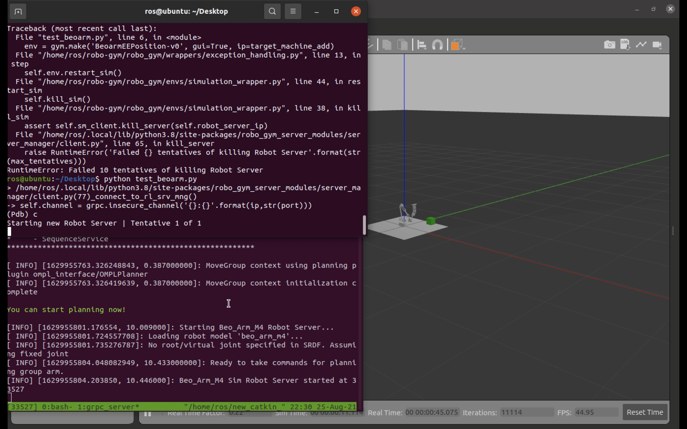
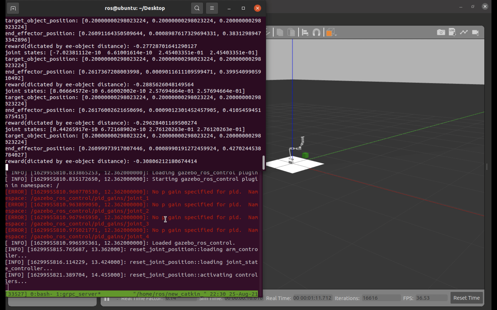

## Setup
Note: this demo requires [robo-gym](https://github.com/jr-robotics/robo-gym) and [robo-gym-robot-servers](https://github.com/jr-robotics/robo-gym-robot-servers) to have been installed in your catkin workspace and assumes you have Ubuntu20.04 with ROS noetic
1. put `beo_arm_m4` and `beo_arm_m4_config` folders in your workspace
2. put `beoarm_robot_server` folder in your workspace and catkin_make
3. put `beoarm` folder in your robogym envs folder
  - `beoarm` should be put in the same folder where you have `mir100` and `ur` folders
4. add the line `from robo_gym.envs.beoarm.beoarm_ee_positioning import BeoarmEEPosition` to the `__init__.py` file in your robogym envs folder
5. add the codes
        ```python
        register(
            id='BeoarmEEPosition-v0',
            entry_point='robo_gym.envs:BeoarmEEPosition',
        )
        ```
to the `__init__.py` file in envs folder's parent folder
6. go to `<your path to robo_gym_server_modules>/robot_server/grpc_msgs` and replace your `python` folder with the `python` folder here
7. go to `<your path to robo_gym_server_modules>/server_manager/server.py` and find the line containing `assert (len(test_client.get_state ...etc.` (should be in function `add_rl_server` and around line90; sorry I don't know where exactly it would be in the original file since I lost track of the changes I made); change this line to `assert (len(test_client.get_state_msg().state_dict.keys()) >= 1)`
8. if all is well then you should be able to run `test_beoarm.py` and see something similar to the demo
  - it's safe to ignore those error messages about "No p gain specified...etc."

## Demo


